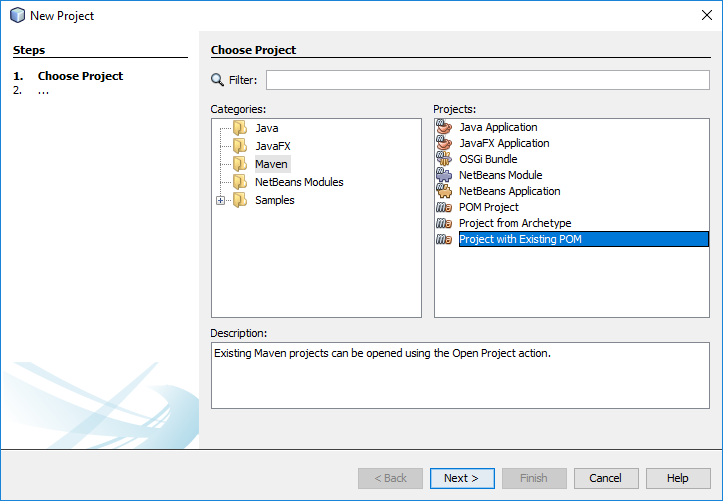
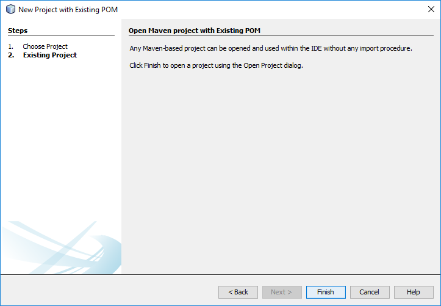
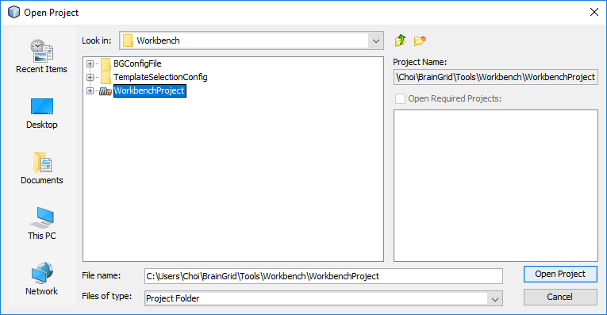

## 1. Getting Started
### 1.1. Clone the repository from GitHub
* Make sure “Git” is installed in your operating system. Check https://git-scm.com/ for more information about Git.

* Clone the repository to a local folder by typing the following command.
```shell
git clone https://github.com/UWB-Biocomputing/WorkBench.git [folder_name]
```
* If you would like to checkout a specific branch or commit, use the following command.
```shell
git checkout [branch_name/commit_id]
```

### 1.2. Compile and build
You can compile and build WorkBench using Maven in a command prompt or using NetBeans.
#### 1.2.1. Maven

* Make sure Maven is installed by checking Maven version using the following command.
```shell
mvn -v
```

* If Maven is installed, the output will be like the screen dump below. Note that Maven is using Java 8, here shown as Java version: 1.8.0_111


* Type the following Maven command under the directory "Tools/Workbench/WorkbenchProject" to compile and create executable JAR file.
```shell
mvn install -Dmaven.test.skip=true
```
* After the project is built successfully, a JAR file "BrainGridWorkbench-1.0-SNAPSHOT.jar " will be created under the directory "Tools/Workbench/WorkbenchProject/target". Run this JAR file to start using the Workbench.

#### 1.2.2. NetBeans

* Create a New Project in NetBeans. Then, select "Maven" under project categories and choose the option "Project with existing POM". And, press “Next”.


 
* After pressing the "Finish" button, choose "Tools/Workbench/WorkbenchProject", then press the “Open Project” button.





* After the project is opened, you can compile and build it by pressing the "Clean and Build Project" Menu option in NetBeans. Or, you can run the program directly.
 
* After the project is built successfully, it will generate a JAR file " BrainGridWorkbench-1.0-SNAPSHOT.jar " under the directory "Tools/Workbench/WorkbenchProject/target". Run this JAR file to start using the Workbench.
